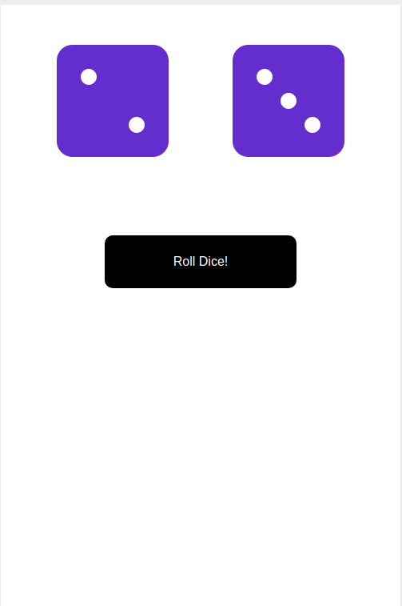

## Dice-project

A  dual-dice web-app  build with reactjs.

## Installation via github:
1. Clone the github project.
2. `cd dice-project-master`
3. Run `npm install`

## Development mode
````
npm start
````
Go to `localhost:3080` to view the Todo app.


# Mobile view

